# Legit-Info

Legit-Info offers a simple `Content Management System`, or CMS for short, 
that delivers legislation content to users.  Legislation is automatically
fetched from various sources as an asynchronous background task so that the
website is not slowed down during search activities.  IBM Watson Natural
Language Understanding is used to minimize the amount of curation effort
needed to provide meaningful title, summary, location and impact attributes.


## Section 1 Administration

Administration allows authorized staff to create and maintain the list of
locations, impact areas, and curated policy legislation.  All of the examples
below use "./stage1" instead of "django-admin" or "python manage.py" and
take all of the same commands and parameters.

* ./stage1  -- sets Use_SQLITE3='True' to use the SQLite3 database
* ./stage2  -- sets Use_SQLITE3='False' to use the Postgresql database

Both ./stage1 and ./stage2 verify that you are in the Pipenv shell already,
and are intended for interactive administration.

For one-line commands, such as for use with cron scheduler, you can use the
alternate versions that will (a) launch pipenv, (b) run the command, and
(c) exit out of Pipenv:

* ./cron1  -- sets Use_SQLITE3='True' to use the SQLite3 database
* ./cron2  -- sets Use_SQLITE3='False' to use the Postgresql database

In other words, issue "./cron1 <command> <parameters>" is equivalent to:

```console
$ pipenv shell
(fix) $ ./stage1 <command> <parameters>
(fix) $ exit
```

You will notice that **Using SQLite3** or **Using Postgresql** issued
when you use these scripts to confirm that your Use_SQLITE3 is set correctly.
You may turn this off by setting CFC_SHOWDB='False' either on the command
line, or permanently in your Operating System Environment variables.

```
(cfc) $ CFC_SHOWDB='False' ./stage1 <command> <parms>
```

You can issue "help" to get a list of commands, or "help <command>", 
"<command> -h", "<command --help" to get details on any specific command.

```
(cfc) $ ./stage1 help
Available subcommands:

[auth]
    changepassword
    createsuperuser

[cfc_app]
    analyze_text    <-- these are custom commands specific to this app
    get_api_data    <-- these are custom commands specific to this app
    scan_json       <-- these are custom commands specific to this app

[contenttypes]
    remove_stale_contenttypes

[django]
    check
    compilemessages
    createcachetable
    dbshell
    diffsettings
    dumpdata
    flush
    inspectdb
    loaddata
    makemessages
    makemigrations
    migrate
    sendtestemail
    shell
    showmigrations
    sqlflush
    sqlmigrate
    sqlsequencereset
    squashmigrations
    startapp
    startproject
    test
    testserver

[django_extensions]
    admin_generator
    clean_pyc
    clear_cache
    compile_pyc
    create_command
    create_jobs
    create_template_tags
    delete_squashed_migrations
    describe_form
    drop_test_database
    dumpscript
    export_emails
    find_template
    generate_password
    generate_secret_key
    graph_models
    list_model_info
    list_signals
    mail_debug
    merge_model_instances
    notes
    pipchecker
    print_settings
    print_user_for_session
    reset_db
    reset_schema
    runjob
    runjobs
    runprofileserver
    runscript
    runserver_plus
    set_default_site
    set_fake_emails
    set_fake_passwords
    shell_plus
    show_template_tags
    show_urls
    sqlcreate
    sqldiff
    sqldsn
    sync_s3
    syncdata
    unreferenced_files
    update_permissions
    validate_templates

[sessions]
    clearsessions

[staticfiles]
    collectstatic
    findstatic
    runserver
```

### Subsection 1.1 Seed Databases

To save time, we have created a Django Fixture called "cfc-seed.json"
that allows you to pre-populate the data with sample impacts, locations,
and a single superuser "cfcadmin" / "Call4Code"

```console
$ ./cron1 ./stage1 loaddata sources/cfc-seed.json
```

To access admin panels, add "/admin" to the main website.  For local
testing, use:  `http://localhost:3000/admin`

Alternatively, launch `http://localhost:3000` and sign in as "cfcadmin",
you will find an "Admin" tab on the upper right of the navigation bar.

To change this fixture, or create your own with updated settings, use:

```console
$ ./cron1 dumpdata auth.user users.profile cfc_app.criteria \
    cfc_app.impact cfc_app.location --output sources/cfc-seed.json
```

Lastly, if you added or removed users, impacts, or locations, and need
to reset it back to this intial state, you can run this command:

```console
$ ./cron1 syncdata cfc-seed.json
```

### Subsection 1.2 Set password for Superuser "cfcadmin"

If you are not happy with the cfcadmin default password, or forgot
what you set it to, you can generate a random password, and use that
to reset the password.  Please note that generate_password has an 
underscore character(_) and the changepassword does not.

```console
$ cd legit-info
$ pipenv shell
(cfc) $ ./stage1 generate_password cfcadmin
**Using SQLite3**
Lv5EN5HvRU

(cfc) [legit-info]$ ./stage1 changepassword cfcadmin
**Using SQLite3**
Changing password for user 'cfcadmin'
Password:                  <-- enter the random password, or choose your own!
Password (again): 
Password changed successfully for user 'cfcadmin'

```

The generate_password and changepassword methods can be used with other
usernames as well.  For example, if an end-user forgot their password, you
can change it to a new random password and send it via email to them.

If you need additional "superuser" accounts, each with their own profile,
you can use the Django `createsuperuser` to create others:

```console
$ cd legit-info
$ pipenv shell
(fix) $ ./stage1 createsuperuser
```

To access admin panels, add "/admin" to the main website.  For local
testing, use:  `http://localhost:3000/admin`

Alternatively, launch `http://localhost:3000` and sign in as "cfcadmin",
you will find an "Admin" tab on the upper right of the navigation bar.


### Subsection 1.3 Impacts and Locations

The cfc-seed.json in step 1.1 above populates the database tables with
example entries to get you started.

#### Section 1.3.1 Impacts

Here is what you will find if you look at them from the Admin panels.

```
Impacts:
* None
* Healthcare
* Safety
* Environment
* Transportation
* Jobs
```

Note that the only required impact is "None".  This will show only in
Administration panels, and not shown to end-users.  This is used by the
IBM Watson Natural Language Understanding (NLU) algorithm to indicate that a
particular legislation does not match the other impact areas.

In the event that the IBM Watson NLU chooses an impact for a particular
legislation, and staff decide to re-classify it to "None", they can do this
from the Admin panels.

Note that Impact=None must exist, but is never 
displayed to advocates.  Here is what the advocate sees instead:

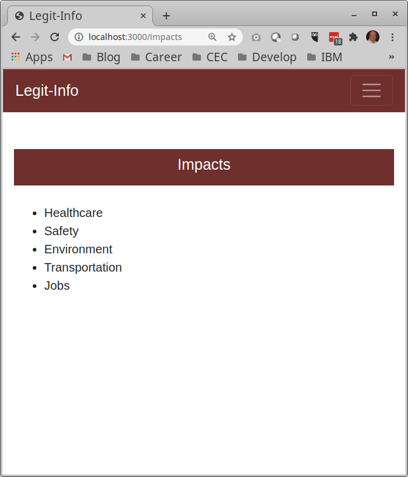

#### Section 1.3.2 Locations

```
Locations:
world
United States
└─ Arizona, USA
    └─ Pima County, AZ
        └─ Tucson, Arizona
└─ Ohio, USA
    └─ Franklin County
        └─ Columbus, OH
```

The first entry must be `world`, with a parent of `world`, in effect pointing
to itself.  This is required for the "ancestor-search" algorithm.  For 
location hierarchies, you must enter the parent before the child.  This
application will detect if the database is empty, and populate it with the
"world" entry for you to get started.

In the above example, you must create
`United States` before you can enter `Arizona` or `Ohio`.

* For `United States`, the parent is `world`
* For `Ohio, USA`, the parent is `United States`
* For `Franklin County`, the parent is `Ohio, USA`
* For `Columbus, OH`, the parent is `Franklin County`

For Legiscan, the Locations "Arizona" and "Ohio" must have their respective
2-letter abbreviations for shortname "AZ" and "OH", and must specify the
Legiscan_id of 3 and 35, respectively.  These are used for the cron job
that auomates the download of legislation for these two states.

You may designate any location by its government level, such as `country`,
`state`, `county`, `city`, `province`, `district`, etc.

Note that Location=world must exist, but is never 
displayed to advocates.  Here is what the advocate sees instead:

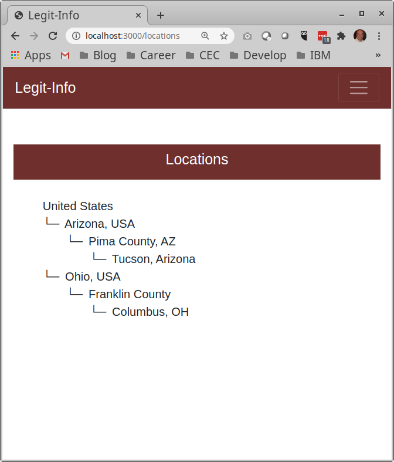


### Subsection 1.4 Laws

To access admin panels, add "/admin" to the main website.  For local
testing, use:  `http://localhost:3000/admin`  From here, you can add
or remove laws, policies, regulations and other proposed legislation.

A cron job will use the Legiscan API to fetch legislation texts. Watson
Natural Language Understanding is used to classify the legislation to
the appropriate impact area.

* key -- a unique value that refers to the specific legislation
* location -- the scope of location, specify the most narrow location,
for example, if legislation only applies to a city, do not specify the
county or state.  If the the legislation applies to multiple cities in 
a particular county, specify the county.
* impact -- select the impact area that is most represented by this law
* title -- phrase a laymen-readable version of the title.
* summary -- write two to four sentences that summarize the impact of this
law for this location.  This can include statistics that support this 
assessment.


While the download is automatic, a curator may want to refined the
wording of the title and summary to be more human-readable.

Here is an example:

```
Key: AZ-SB-1682 (2020)
Location: Arizona, USA
Impact: Safety
Title: Protection requirements for foster children
Summary:  The results of background checks for each adult member of the 
foster care placement household will be used to determine danger level. 
oster children shall be kept safe from placements that constitute a Tier 5 
danger. If the department determines that a placement constitutes a tier 5 
danger, the department shall remove all foster children from this placement 
within four(24) hours after making the determination.
```

### Subsection 1.5 Staff

The cfcadmin can create additional users, referred to as `staff` that have 
selected permissions to add, modify or delete locations, impact areas, or 
curated legislation content.


## Section 2 Anonymous Search

Advocates do not need to pre-register to search for legislation.  This
is referred to as "anonymous search".

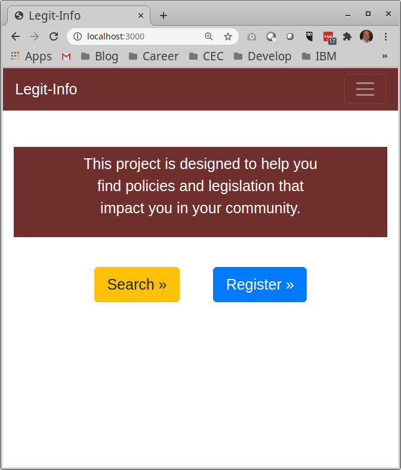

### Subsection 2.1 Initiate Search

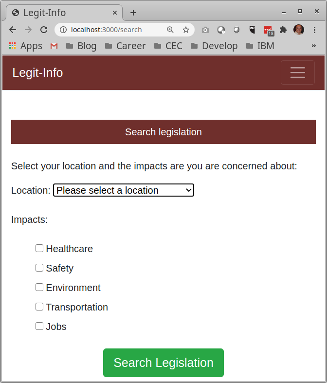

From the home page, `http://localhost:3000` select "Search" either from
the upper right navigation bar, or the button at the bottom of screen.

Select the location, and one or more impact areas you are concerned about.

Press the "Search Legislation" button.  The process is called an 
"ancestor search" in that not only will it find legislation related to the
location specified, but also all legislation in parent governments.  For
example, if you specify "Frankin County", you would get laws from Franklin,
as well as laws that relate to Ohio overall, and USA as well, but not any
from Columbus OH as that is more specific.

### Subsection 2.2 Results Page

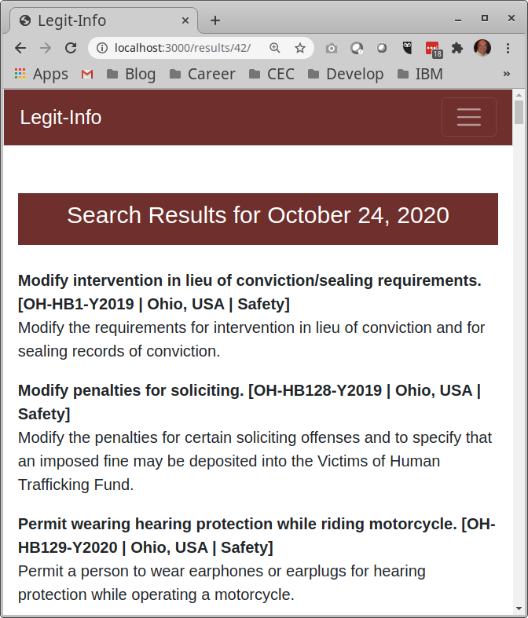

A list of legislation that matches the search criteria is found.  The 
anonymous advocate may choose to "Print Results", "Save CSV File", or
"Search Again".

### Subsection 2.3 Print Results

The results can be printed to PDF file or local/network printer.  The
code has added a title and removed the buttons that would normally appear
in a "browser print" function.

### Subsection 2.4 Save CSV File

The results can be downloaded as a comma-separated-variable (CSV) file.
Selecting "Download" will initiate this download.


## Section 3 Registration and Profile

To simplify repeat usage, an advocate may register their profile.  From
the home page, `http://localhost:3000` select "Register".

* First screen: enter username and password, re-enter same password.

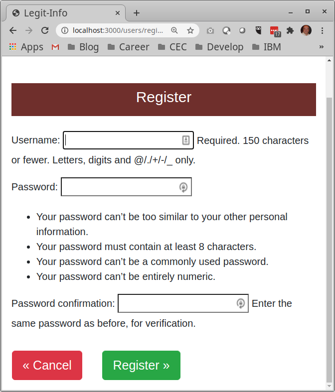

* Second screen: enter first and last name, location and impact areas.

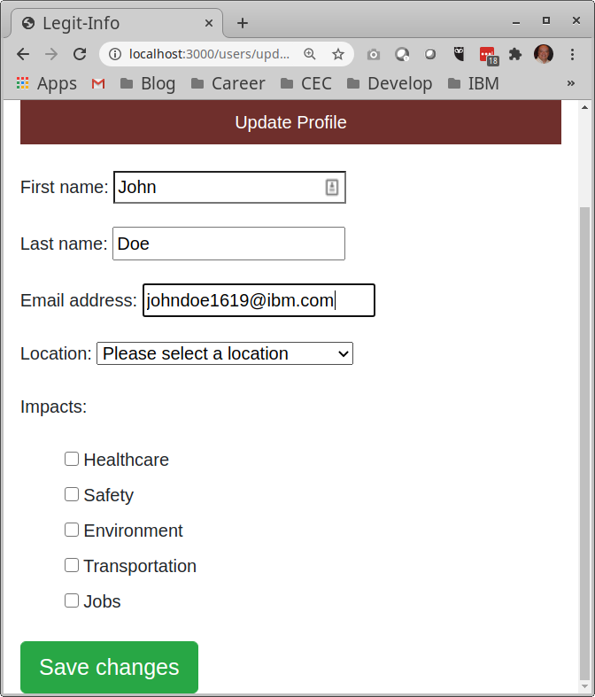
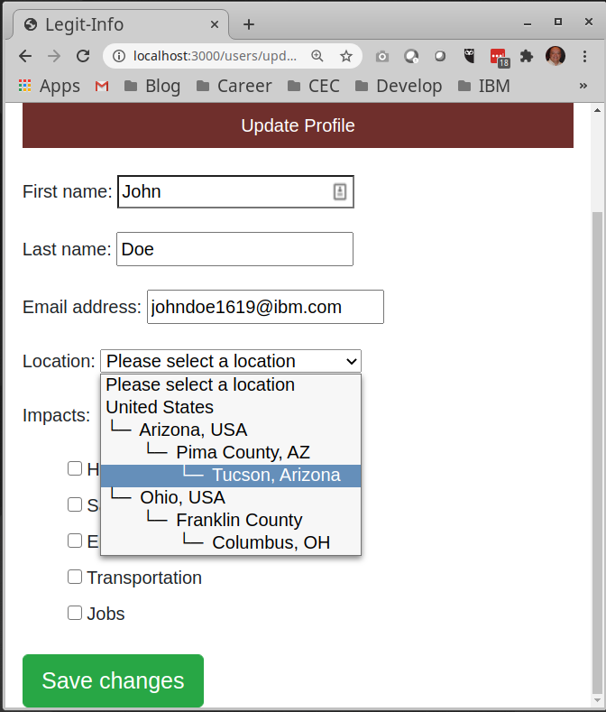
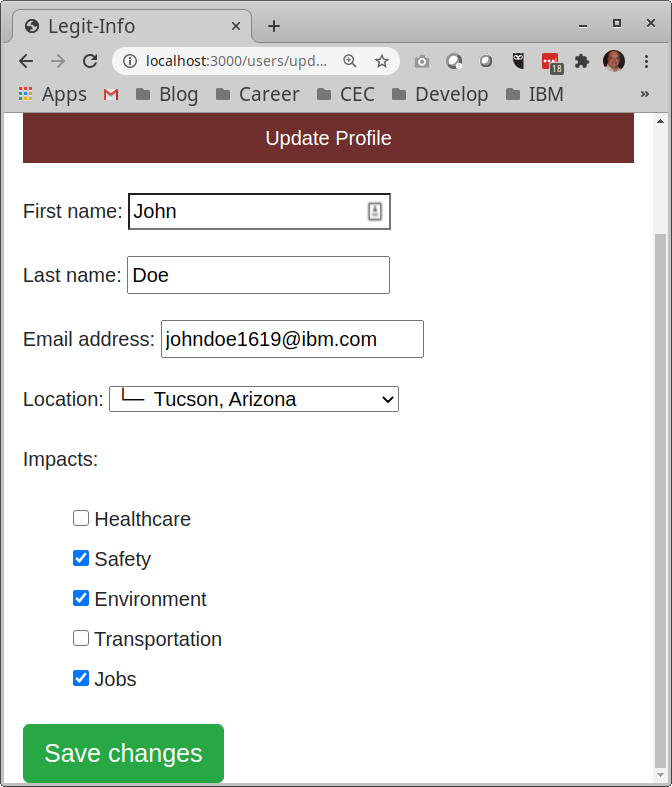

When you sign in, you will see your name on the upper right corner.

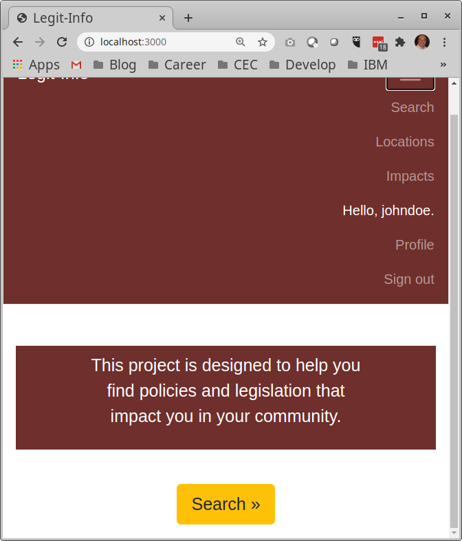

Advocates can review their profile and update any time.

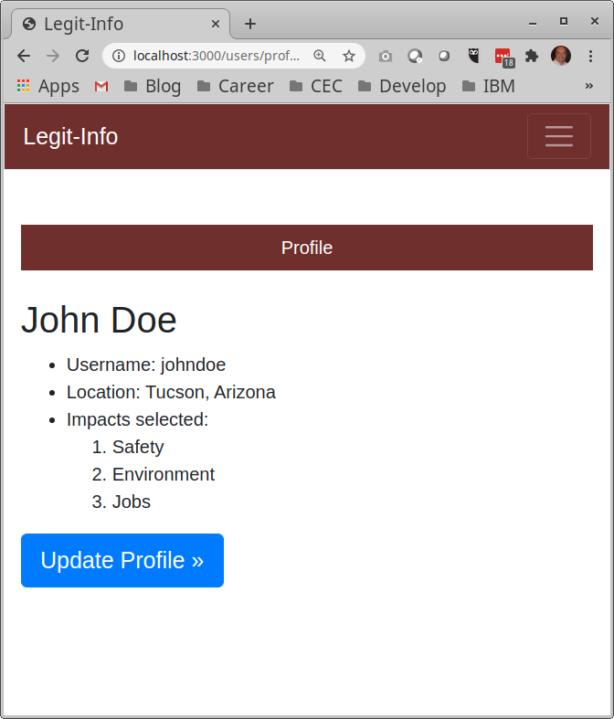


## Section 4 Profile Search

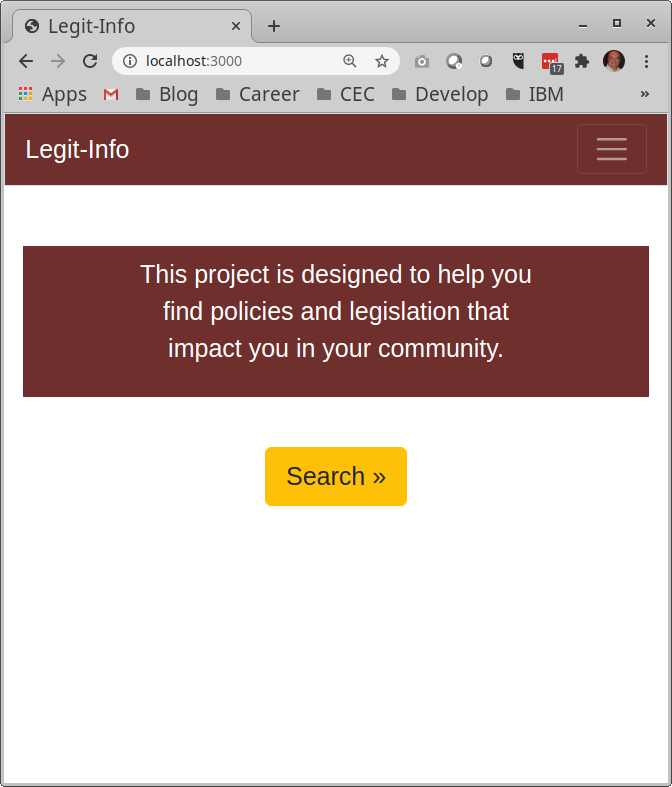


Registered advocates can perform search using their profile to set the
defaults.  From home page, `http://localhost:3000` select "Sign in".

Once signed in, select "Search" to initiate search screen.  The advocate
can leave the defaults as is, or modify the location and/or impact areas.

### Subsection 4.1 Results Page

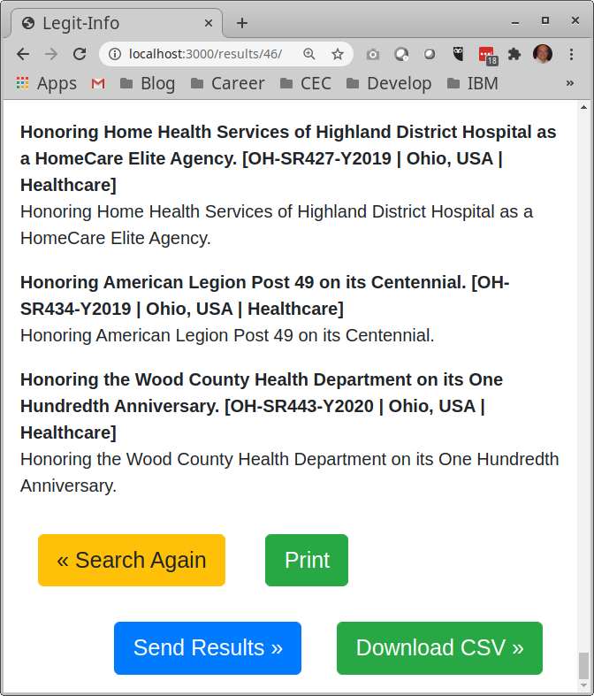

The results page is similar to section 2.2, but with an additional feature:
"Send Results"

### Subsection 4.2 Send Results

When "Send Results" is selected, a confirmation screen will indicate that
the email was sent, or indicate there was a failure in the transmission.

To test the Send Results e-mail functionality, you can set up a free Mailtrap 
account using the steps below.  This can be used in all stages of deployment.

1. Go to [Mailtrap](https://mailtrap.io/) and sign up for a free account.

2. Go to your Demo Inbox and copy your credentials:

```console
user_name => 'your_username',
password => 'your_password',
address => 'smtp.mailtrap.io',
domain => 'smtp.mailtrap.io',
port => '2525',
```

3. In your virtual environment, export your credentials:
```console
export EMAIL_HOST='smtp.mailtrap.io'
export EMAIL_HOST_USER='your_username'
export EMAIL_HOST_PASSWORD='your_password'
export EMAIL_PORT='2525'
```

4. Test that this is working correctly using this command:

```
(cfc) [legit-info]$ ./stage1 sendtestemail cfcadmin@us.ibm.com
**Using SQLite3**
```

Now, when an end-user clicks "Send Results" from the app, the results 
should be e-mailed to your Mailtrap inbox.


## Conclusion

The project allowed contributors to learn about Python, Django and Bootstrap.

## Results

This project has completed the first three hills. 

1. Advocates are aware of policy that is being considered that is 
highly impactful to them, without needing to follow every vote.

The search can be done for a specific location, and one or more impact
areas.  This search can be done anonymously, or with a registered profile.

2. Advocates are able to understand the specific impact of proposed 
policy on them without being a legal expert.

Curated content by legal or subject matter experts can be entered by staff
to have laymen-readable title and summary for each policy.

3. Advocates are able to share opinions so they can influence policy 
decisions before they are finalized.

The search results can be printed, downloaded as CSV file, or sent to 
yourself so that it can then be forwarded onto the rest of the social 
followers.


## Acknowledgments

Our team would like to acknowledge the assistance of Matt Perrins,
Jermaine Edwards, Victor Brown and Tedd Ginsley.
