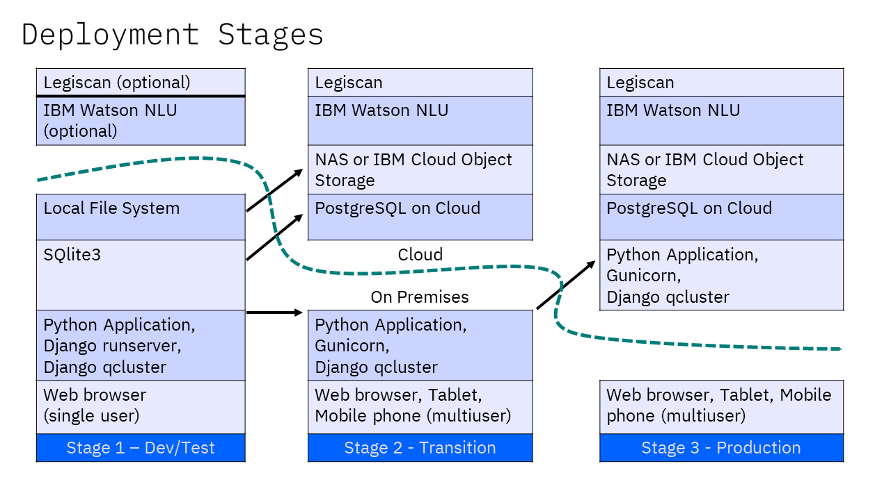

# Stage 2



Stage 2 is intended to help transition to production deployment.

* The file object storage (FOB) that contains the PDF, HTML, JSON and TXT files
of downloaded-legislation will now be in the Cloud, either on Networked
Addressable Storage (NAS) file service, or IBM Cloud Object Storage.

* The database changes from single-user SQLite3 to multiuser PostgreSQL in 
the CLoud.

* The web server remains on the local workstation, but changes from 
single-user "Django runserver" to multiuser "Gunicorn", allowing the tester 
to use multiple "clients" to the single server.

* Clients must be on the same network sub-net.  For example, on a home
network with 192.168.1.1 gateway, any system with 192.168.1.x should work.
For example, you can have a browser (192.168.1.2) and a mobile phone 
(192.168.1.3) accessing the application at the same time.


## Stage 2: Pre-Production

1. Download and install the following modules.

* [Gunicorn](https://docs.gunicorn.org/en/stable/index.html)

2. Install all of the IBM Cloud / Cloud Foundry command line tools. 

Log into [IBM Cloud](https://cloud.ibm.com) select Manage->Access (IAM)
in the upper right menu.  Then select "API Keys" from the left panel.
Choose "Create an IBM Cloud API Key", and download the "apikey.json" file
created.

Move this to your home user directory and rename as follows:
```bash
mv ~/Downloads/apikey.json ~/.ibmcloud_api_key_cf
```

DO NOT put your credentials into the Django application Github repo!

Once this API key is available, there is a script to login and set 
all of the Cloud Foundry resources for this application:

```bash
(env) [Legit-Info]$ ./iclogin

API endpoint: https://cloud.ibm.com
Region: us-east
Authenticating...
OK

Targeted account Call for Code Deployment Team (d86af7367f70fba4f306d3c19c799841) <-> 2243326
Targeted Cloud Foundry (https://api.us-east.cf.cloud.ibm.com)
Targeted org cfc-team-external-apps
Targeted space cfc-legit-info-space
                      
API endpoint:      https://cloud.ibm.com   
Region:            us-east   
User:              tpearson@us.ibm.com   
Account:           Call for Code Deployment Team (d86af7367f70fba4f306d3c19c799841) <-> 2243326   
Resource group:    cfc-team-legit-info   
CF API endpoint:   https://api.us-east.cf.cloud.ibm.com (API version: 2.161.0)   
Org:               cfc-team-external-apps   
Space:             cfc-legit-info-space   
```

3. Create a Postgresql pod on IBM Cloud.  For our system, we created
the following:

```bash
Database name:  cfcappdb
Postgresql username:  pguser
Postgresql password:  <provide an appropriate password>
```

4. Export the following OS Environment variables:

```bash
export POSTGRESQL_USER='pguser'
export POSTGRESQL_PASSWORD='<password here>'
export PGPASSWORD=$POSTGRSQL_PASSWORD
```

5. Verify connection with command line

You can define an alias command as follows:

```bash
alias appdb='psql -h localhost -p 5432 -d cfcappdb -U pguser -w '
```

Explanation:

```
-h localhost --- this goes to the localhost, which port forwards to IBM Cloud
-p 5432      --- this is the port that Postgresql listens to
-d cfcappdb  --- this is the database name
-U pguser    --- this is the username 
-w           --- tells system to use PGPASSWORD environment variable
```

Now you can access the Postgresql database as follows:

```
[ ~]$ appdb
psql (10.14, server 10.12)
Type "help" for help.

cfcappdb=> help
You are using psql, the command-line interface to PostgreSQL.
Type:  \copyright for distribution terms
       \h for help with SQL commands
       \? for help with psql commands
       \g or terminate with semicolon to execute query
       \q to quit
cfcappdb=> \q
```

6. Pre-populate the Postgresql database tables.

Create Superuser on Postgresql.  Since we cannot copy data over from
SQlite3 to Postgresql, we will have to re-enter all the data using the 
application.  To get us started, we need to re-create the superuser 'cfcadmin'

```
(env) [Legit-Info]$ ./stage2 migrate
(env) [Legit-Info]$ ./stage2 createsuperuser
**Using Postgresql**
Username (leave blank to use 'yourname'): cfcadmin
Email address: yourname@us.ibm.com
Password: <password here>
Password (again): <password here>
Superuser created successfully.
```

As with Stage 1, selecting the "Location" will pre-populate the 
Locations with "world", "usa", "arizona" and "ohio".  Selecting
the "Impacts" will pre-populate with five imact areas.


Step 7: Run local version of Gunicorn.

The difference between the Django Development server (runserver) and
Gunicorn is that Gunicorn can handle concurrent users. We have created
a shortcut "app.sh" to run Gunicorn locally.  Gunicorn can be used with
local SQLite3 or remoe Postgresql, by specifying USE_SQLITE3 accordingly.

```
(env) [Legit-Info]$ USE_SQLITE3=False ./app.sh
[2020-08-26 14:24:42 -0700] [23322] [INFO] Starting gunicorn 20.0.4
[2020-08-26 14:24:42 -0700] [23322] [INFO] Listening at: http://0.0.0.0:3000 (23322)
[2020-08-26 14:24:42 -0700] [23322] [INFO] Using worker: sync
[2020-08-26 14:24:42 -0700] [23325] [INFO] Booting worker with pid: 23325
**Using PostgreSQL**
```

As with the Django Development Server (runserver), press Ctrl-C to exit.

Step 8: Test from another system

If you have other systems, which could be a smartphone or template, on the
same network subnet, you can test Gunicorn from the other machine.

For example, if you are running Gunicorn on 192.168.1.3, then from your
smartphone or table, specify:  `http://192.168.1.3:3000`

If this does not work, you may need to change the settings in your network
firewall.

